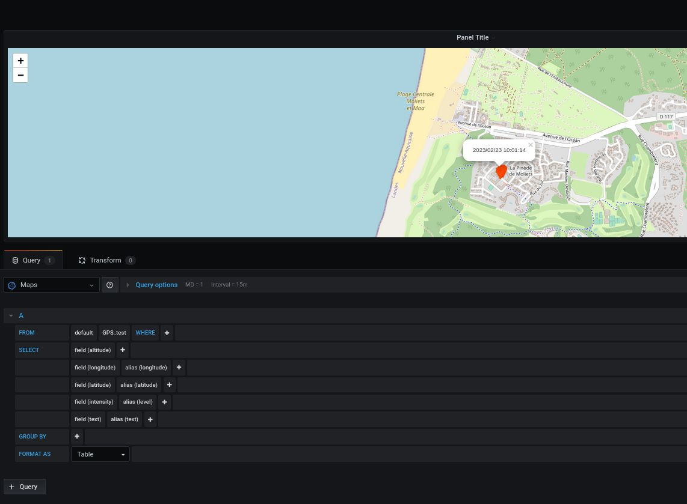

#### Basic test

You have to find on which port the GPS is talking, then :  
`./sdrvm -g /dev/TTYACM0 -f gps.js`

gps.js  

#### Log to CSV file

Script: `gps2csv.js`  

Output file : `/tmp/gpslog.csv`  

#### Send to influx/grafana

Script: `gps2influx.js`  

##### Grafana panel

Basic example (tested with TrackMap plugin and grafana v7.1).  

We send data to influx server : `192.168.14.10:8086'`  
Database name  : `OSM_maps`  
Measurement name : `GPS_test`

'text' field will be displayed in the marker-popup  

#### GPS related scripts :

- GPS [captures]( ../RX/spectrum/GPS/)  
- SDRVM : [CSVSpectrum()](http://sdrvm.sdrtechnologies.fr/iq/#csvspectrum) : generate spectrum + GPS using internal command  

     
     
