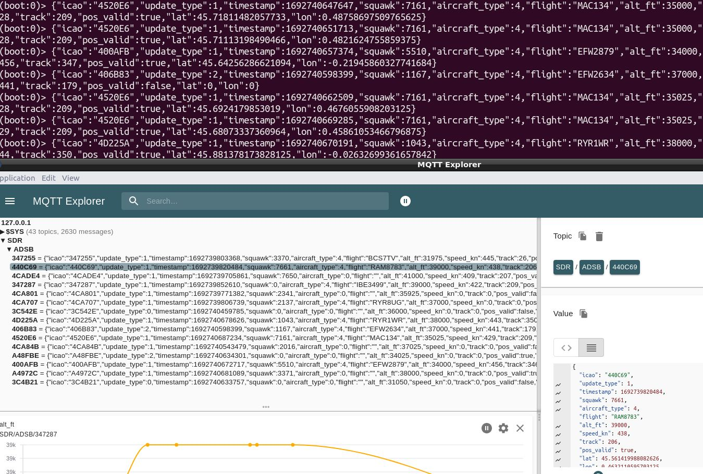

### ADSB

- Do not change samplerate (2e6) !  
- Doc : [here](http://sdrvm.sdrtechnologies.fr/adsb_decoder/)   

#### Basic ADSB example

Script : `ADSB_basic.js`


### adsb_MQTT.js

Send ADSB frames to MQTT  

- Topic by plane reg. : /SDR/ADSB/<ICAO>  

Use `mosquitto_sub -h 127.0.0.1 -t SDR/ADSB/#`

- MQTT-Explorer view :



### adsb_grafana.js  

Send ADSB frames to MQTT and Grafana using native GeoMap plugin.  


#### Grafana setup

- create influxDB 'ADSB' database using the CLI  

``` 
influx
create database ADSB
exit
```

- Connect grafana to the new DB :  
--> Left bar : **Configuration / Data sources**  
Use 'ADSB' as name and '127.0.0.1:8086' as HTTP URL  

- Grafana v8 : import `ADSB_dashboard.json` as new dashboard:  

--> Left bar : **Dashboards / Manage / import**  
Click 'Test and save'.  


