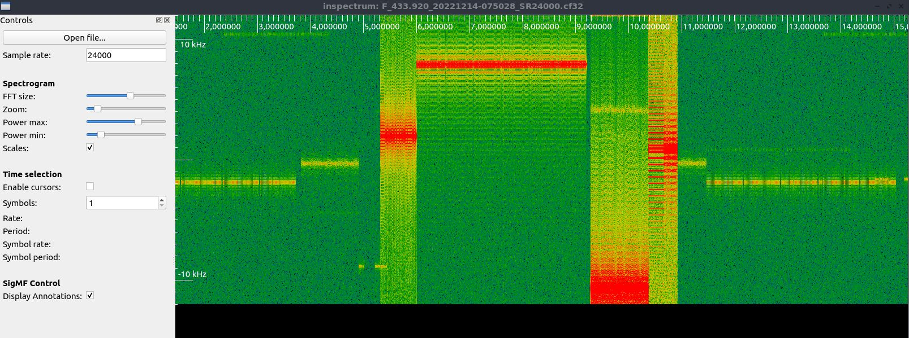

#### 5_DDC_MQTT_RECORD.js  


From a DDC channel, only keep IQ samples with a signal above the trigger level.
Send level to MQTT.
 
Provided example records ISM devices on 433.920 (sensors, keys).




#### basic_DDC_recorder.js  


Continuous recording of IQ through a DDC. Press CTRL-C to end recording.  


#### DDC_MQTT.js  

Send the RMS level of a DDC channel to MQTT.  
 


#### DDC_from_file.js  


Replay IQ file of a given samplerate, output file at lower samplerate after applying a frequency shift from center.
 

* Samplerate : input file: 4 MS/s, 200kS/s output.  
```
var input_samplerate=4000e3;
var output_samplerate=200000;
```
 
* Frequency shift from center

```
var shiftcenter = -150e3;
slice.setCenter(shiftcenter) ;
```

#### DDC_file_MQTT.js    

Replay IQ file, send RMS level to MQTT 
