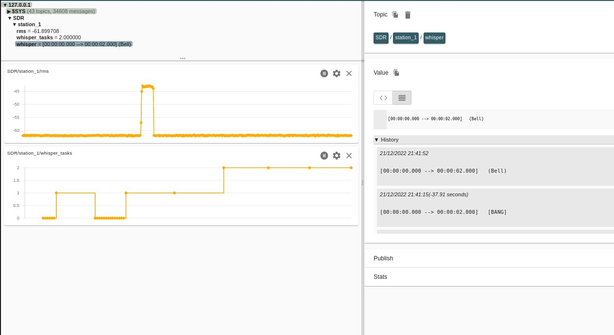

# DDC Whispher

[Digital Down Conversion (DDC)](https://en.wikipedia.org/wiki/Digital_down_converter) integrated with [OpenAI's Whispher](https://github.com/openai/whisper) speech recognition model for [Amplitude Modulated (AM)](https://en.wikipedia.org/wiki/Amplitude_modulation) and [Frequency Modulated (FM)](https://en.wikipedia.org/wiki/Frequency_modulation) signals.

Example video of FM voice-to-text: [short video](./_demo_DDC_whisper.mp4)

DragonOS video demonstration: [DragonOS FocalX Captured IQ to Text Faster w/ SDR4space/WhisperCPP/Mosquitto (RTLSDR)](https://www.youtube.com/watch?v=oCmFTHm3oX4)  

Thanks to [@paulzcgu](https://github.com/paulzcgu) for [writing a set of scripts](https://github.com/paulzcgu/sdr_multi_producer) based on this example, managing several SDR on a RPi4 running DragonOS  
(tnx for this info @CemaXecuter)

## Usage   

`/opt/vmbase/sdrvm -f DDC_MQTT_FM_whisper.js`  for FM modulation  

`/opt/vmbase/sdrvm -f DDC_MQTT_AM_whisper.js`  for AM modulation  

`/opt/vmbase/sdrvm -f DDC_MQTT_FM_whisper.js --args=156.8` listen on 156.800MHz

## Word Cloud in Kibana

1. Clone the `word-cloud` branch of the [mqtt-to-kibana repository](https://github.com/irongiant33/mqtt-to-kibana/tree/word-cloud) 
2. Ensure line 7 of `subscriber.py` from the above repository matches line 17 of `start_whisper.js` within the `DDC_whisper` folder
    - line 7 of `subscriber.py`: `whisper_topic = "SDR/station_1/whisper"`
    - line 17 of `start_whisper.js`: `'topic': 'SDR/station_1/whisper',`
3. Ensure the mqtt server address is identical in `subscriber.py` of the above repository and in `settings.js` in `DDC_whisper`
    - line 6 of `subscriber.py`: `mqtt_broker_address = "0.0.0.0"`
    - line 41 of `settings.js`: `var mqtt_server = '127.0.0.1';`
4. Ensure `var use_mqtt = true;` on line 40 of `settings.js`
5. Start elasticsearch and kibana according to the guide in the mqtt-to-kibana repository.
6. Start the subscriber: `python3 subscriber.py`
7. Start `sdrvm` according to the [usage](#usage) instructions above.

## Initial configuration

### whisper.cpp  

#### Dragon OS

* Using DragonOS you have nothing to do. whisper.cpp application is installed in /usr/src.  

#### Manual installation

Install as described in the main github page https://github.com/ggerganov/whisper.cpp.  

Download model tiny.en. Execute from whisper directory : `bash ./models/download-ggml-model.sh tiny.en`  

The script is queuing WAV files before transcoding by whisper.cpp to avoid CPU congestion. Files to process are listed in '/tmp/tasks.txt' file.  

### Prepare settings.js file

* Modify the path to whisper directory in `start_whisper.js` file with a trailing /:  
    1. `var whisper_path='/home/$USER/whisper.cpp/';`  
    2. Replace $USER by the system username.  
    3. The model name is also defined in this file in case you want to test another one (after download).  

* Set `var use_mqtt = true;` to enable MQTT messaging.  
* Set `var debug=false;` to get more messages on terminal.  
* Frequency to listen/record is: central frequency + offset_center    

435.050 MHz here :  
``` javascript

var whisper_path='/usr/src/whisper.cpp/';

// SDR 

// Listening frequency : center_freq + offset_center
var center_freq=434.8;
var offset_center = 250e3; // offset from center, tune to the frequency to monitor
var rx_gain=35;

var threshold= 10; // trigger level over noise level to start record

// MQTT
// Get messages :
// mosquitto_sub -h <mqtt_server_ip> -t SDR/station_1/rms will display received level on terminal.
// transcoded messages by whisper.cpp from WAV : mosquitto_sub -h <mqtt_server_ip> -t SDR/station_1/whisper

var use_mqtt = false;   //  true/false
var mqtt_server = '127.0.0.1';

// destination directory for IQ, WAV and txt files (with trailing /)
var dest_folder='/tmp/'

// Add more messages (signal level , whisper stdout + stderr)
var debug=false;   // true/false

```

### DDC_MQTT_XX_whisper.js file

- Adapt the soapy driver :  
```javascript
var rx = Soapy.makeDevice( {'query' : 'driver=rtlsdr'});  
```

### MQTT 

Signal level for the channel is sent to MQTT broker on localhost (`127.0.0.1`).  

As basic test `mosquitto_sub -h 127.0.0.1 -t SDR/station_1/rms` will display received level on terminal.  

Transcoded messages from WAV : `mosquitto_sub -h 127.0.0.1 -t SDR/station_1/whisper`  

#### Using MQTT-Explorer

Left : signal level, number of WAV files in whisper's queue.  

Right : message decoded by whisper.cpp.  

  

### Output files :  

F_435.051_20221209-144646.cf32.wav.txt  --> text coming from whisper.cpp for this wav  

F_435.051_20221209-144646.cf32_audio.png  --> spectrogram of the wav file  

F_435.051_20221209-144646.cf32.wav   --> NBFM demodulated audio  

### Testing

**Note**: The FM decoder only works on NarrowBand FM transmissions.

#### Walkie Talkie

- Set your walkie-talkie to 435.050 MHz NFM, with very low power (the minimum).  
- Launch `DDC_MQTT_FM_whisper.js` script  
- After the baseline step (define noise floor by taking 20 measurements), send a short transmission by pressing the PTT. Check if you get recording files in /tmp.  
- If OK, go away from few meters to avoid saturation, press PTT then speak clearly. The best is to start with a short message containing numbers or letters in international code. Then continue with a short sentence.    
- Wait few seconds to get the result on screen. Decoding may take some time!

#### Weather Station

1. Find the weather station near you: https://www.weather.gov/nwr/station_search
2. Note the frequency and configure it in your `settings.json`
3. Adjust the `recorder_limit` variable in `settings.json` to tune how long you want to capture the weather station before decoding

## TODO

- [x] publish decoded text to MQTT and then use your MQTT to Kibana to generate a word cloud.
    - See [word cloud in Kibana](#word-cloud-in-kibana) section above for solution
