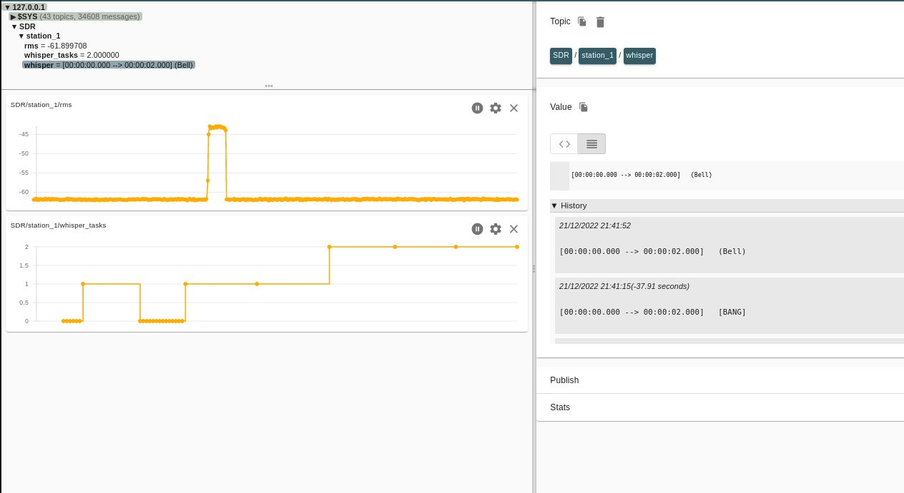
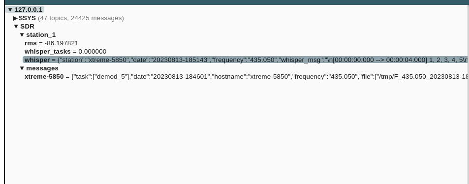

Example video with MQTT/GPS support : 

DragonOS videos tutorial and use cases  : 
- [DragonOS FocalX Captured IQ to Text Faster w/ SDR4space/WhisperCPP/Mosquitto (RTLSDR)](https://www.youtube.com/watch?v=oCmFTHm3oX4)  
- with GPS support : [DragonOS FocalX DEFCON Remote RF Spectrum Monitoring w/ SDR4space + WhisperCPP (KrakenSDR, HaLow)](https://www.youtube.com/watch?v=9ZGlIJ3gz-Y)  

Thanks to [@paulzcgu](https://github.com/paulzcgu) for [writing a set of scripts](https://github.com/paulzcgu/sdr_multi_producer) based on this example, managing several SDR on a RPi4 running DragonOS  
(tnx for this info @CemaXecuter)

#### Usage   

This version adds GPS support, improved MQTT reporting.  

Default receiving frequency is 435.050 MHz.  

`/usr/src/SDR4space/sdrvm -f DDC_MQTT_FM_whisper.js`  for FM modulation  
`/usr/src/SDR4space/sdrvm -f DDC_MQTT_AM_whisper.js`  for AM modulation  

- with arguments, listen on another frequency :  
`/usr/src/SDR4space/sdrvm -f DDC_MQTT_FM_whisper.js --args=156.8` listen on 156.800MHz  

- using GPS (connected to /dev/ttyACM0) :  
`/usr/src/SDR4space/sdrvm -g /dev/ttyACM0 -f DDC_MQTT_FM_whisper.js --args=156.8`  

Ensure the GPS is running in NMEA mode.  
For somes case we had to stop gpsd daemon.  

## Initial configuration

### whisper.cpp  

Install by default.

#### Dragon OS
* Using DragonOS you have nothing to do. whisper.cpp application is installed in /usr/src.  

#### Manual installation

Install as described in the main github page https://github.com/ggerganov/whisper.cpp.  
Download model tiny.en. Execute from whisper directory : `bash ./models/download-ggml-model.sh tiny.en`  


The script is queuing WAV files before transcoding by whisper.cpp to avoid CPU congestion. Files to process are listed in '/tmp/tasks.txt' file.  

### Prepare settings.js file
*  (optional) Modify the path to whisper directory in `start_whisper.js` file, end with a trailing /:  
  `var whisper_path='/home/$USER/whisper.cpp/';`  
   Replace $USER by the system username.  
   The model name is also defined in this file in case you want to test another one (after download).  

* Set MQTT server to connect |var mqtt_server = '127.0.0.1';`
* Set `var mqtt_level = true;` to permanently send the RF level through MQTT.
* Set `var debug=true;` to get more messages on terminal.  
* Frequency to listen/record is: central frequency + offset_center    (example below is for 435.050 MHz by default)

#### settings.js variables to check  

``` javascript

var whisper_path='/usr/src/whisper.cpp/';
var whisper_model='ggml-tiny.en.bin';


// SDR 

// Listening frequency : center_freq + offset_center
var center_freq=434.8;
var offset_center = 250e3; // offset from center, tune to the frequency to monitor
var rx_gain=35;

var threshold= 10; // trigger level over noise level to start record

// MQTT
// Get messages :
// mosquitto_sub -h <mqtt_server_ip> -t SDR/station_1/rms will display received level on terminal.
// transcoded messages by whisper.cpp from WAV : mosquitto_sub -h <mqtt_server_ip> -t SDR/station_1/whisper

var mqtt_level = true;   //  true/false
var mqtt_server = '127.0.0.1';

// destination directory for IQ, WAV and txt files (with trailing /)
var dest_folder='/tmp/'

// Add more messages (signal level , whisper stdout + stderr)
var debug=false;   // true/false

// fake GPS (force position if no GPS connected)
var lat=36.117;
var lon=-115.172;
var alt=11;
var gpsfix=false;


```

### DDC_MQTT_XX_whisper.js file

- Adapt the soapy driver :  
`var rx = Soapy.makeDevice( {'query' : 'driver=rtlsdr'});  

### MQTT 

Signal level for the channel is sent to MQTT broker on localhost (127.0.0.1).  

As basic test `mosquitto_sub -h 127.0.0.1 -t SDR/station_1/rms` will display received level on terminal.  
Transcoded messages from WAV : `mosquitto_sub -h 127.0.0.1 -t SDR/station_1/whisper`  

A fnial report is sent through MQTT using JSON format, with following informations :  
date/time, frequency, hostname, whisper message, GPS location.

#### Using MQTT-Explorer

Left : signal level, number of WAV files in whisper's queue.  
Right : message decoded by whisper.cpp.  

  

- MQTT messages topics :
  
 
  

### Output files :  

F_435.051_20221209-144646.cf32.wav.txt  --> text coming from whisper.cpp for this wav  
F_435.051_20221209-144646.cf32_audio.png  --> spectrogram of the wav file  
F_435.051_20221209-144646_FM.wav   --> NBFM demodulated audio  


### Testing

- Set your walkie-talkie to 435.050 MHz NFM, with very low power (the minimum).  
- Launch `DDC_MQTT_FM_whisper.js` script  
- After the baseline step (define noise floor by taking 20 measurements), send a short transmission by pressing the PTT. Check if you get recording files in /tmp.  
- If OK, go away from few meters to avoid saturation, press PTT then speak clearly. The best is to start with a short message containing numbers or letters in international code. Then continue with a short sentence.    
- Wait few seconds to get the result on screen. Decoding take some time !   
