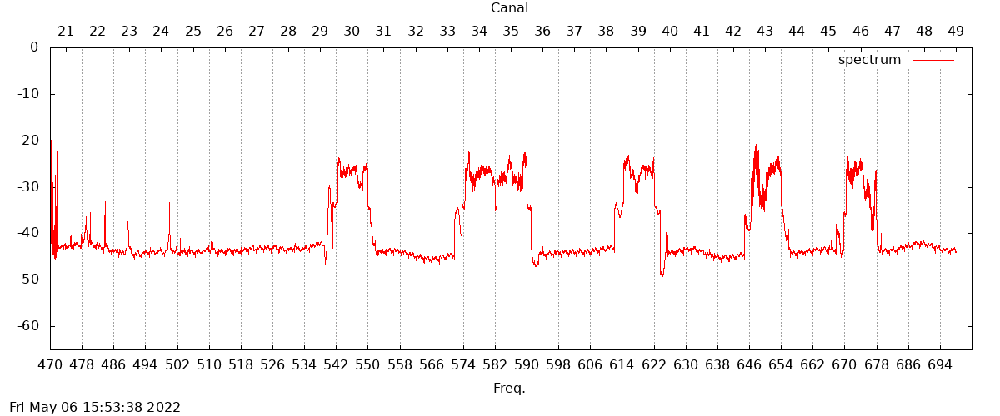
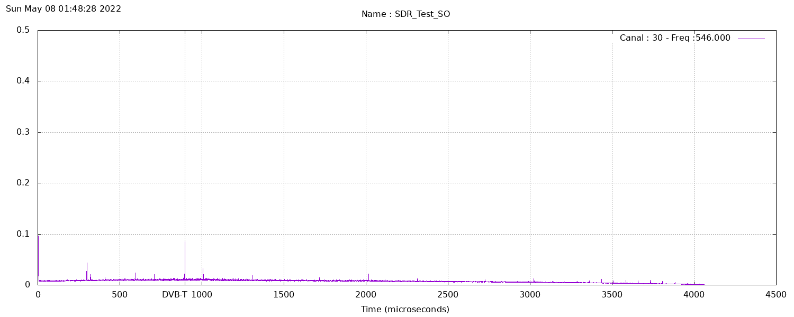

Blog post URL : [The SDRVM in Action : part 1- TV Broadcast Monitoring](https://www.sdrtechnologies.fr/applied-sdrvm-part-1-low-cost-tv-broadcast-monitoring/)

### DVB-T monitor

- Performs a spectrum scan on 470-694 MHz range

- Display a plot of the spectrum, using the TV channels numbering ( 8MHz spacing)

- Evaluate autocorrelation for each channel.

- Valid for Europe DTV (tested in France) only

#### Spectrum plot

Use [spectrum_TNT.js](spectrum_TNT.js) and [spectrum_TNT.gnu](spectrum_TNT.gnu)

#### Autocorrelation

Use [tnt_monitor.js](tnt_monitor.js) and [plot_AC.gnu](plot_AC.gnu)

