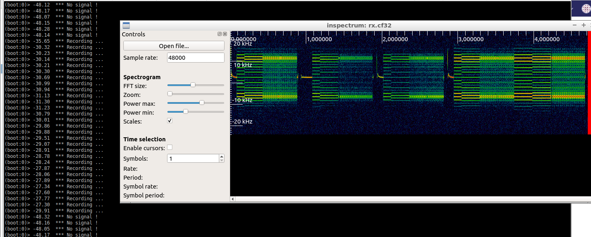

## Capture and store IQ records
 

Three differents captures method :   

*   rx.Capture(): capture the whole band  (fixed duration, whole spectrum) 
*  rx.captureSubBand() : capture a subband (fixed duration, portion of the spectrum)  
*  DDC() : capture a subband (continuous stream, portion of spectrum)  

Note: the first two methods are easy to implement. However final IQ file is available only at the end of the  record sequence.  
Record time duration is set through the samples number to record (provided as parameter)  and heavy relying on free memory.

### rx_capture.js

Srcipt : [1_rx_capture.js](./1_rx_capture.js)

* Basic capture, record 8M samples at 2MSps (duration 4seconds)

``` text
Exact sample rate is: 2000000.052982 Hz
(boot:0)> Freq : 466 MHz
(boot:0)> SR : 2000000
[INFO] Using format CF32.
(boot:0)> Start capture
(boot:0)> IQData object dump:
(boot:0)>  name       : no_name
(boot:0)>  sample rate: 2000000 Hz
(boot:0)>  length     : 8000000 samples
(boot:0)>  Center Frq : 466.000 MHz
(boot:0)>  Number of channels : 1
(boot:0)>  duration   : 4.000 secs. [1852.5 msecs]
(boot:0)>  Attribute  : not set
```


### rx_capture_subband
Script : [2_rx_capture_subband.js](2_rx_capture_subband.js)

* Record a subband of IQ samples to disk, bandwidth 48kHz, duration 40 seconds.

``` text
(boot:0)> Freq : 466 MHz
(boot:0)> SR : 1000000
(boot:0)> Capture radio ok, Sample rate is :1 MSPS
[INFO] Using format CF32.
(boot:0)> IQData object dump:
(boot:0)>  name       : no_name
(boot:0)>  sample rate: 200000 Hz
(boot:0)>  length     : 8000000 samples
(boot:0)>  Center Frq : 466.150 MHz
(boot:0)>  Number of channels : 1
(boot:0)>  duration   : 40.000 secs. [18525.2 msecs]
(boot:0)>  Attribute  : not set
(boot:0)> File size: 64000000
```

### DDC
#### rx_DDC.js
Script : [3_rx_DDC.js](3_rx_DDC.js)  


This is the best and recommended method to record IQ, using a subband and predefined offset from center frequency.  
Continuous stream is stored to disk, there is no limit on duration except the free space on HDD.  
To stop record press CTRL-C.  
  
From [sat_receiver example](../sat/sat_receiver) we also introduce a way to stop recording using MQTT command, to quit recording task.  

*  Output file  
A FIFO file can be used as output file allowing to retrieve samples in real time for a third-party application like GNUradio, GQRX.

#### rx_DDC_silence.js

Script :  [4_rx_DDC_silence.js](./4_rx_DDC_silence.js)

Do not record IQ if the signal level is below the defined trigger level.  

We are using the same script as before, however we introduce a `trigger` variable to decide if we keep collected block  samples or throw them to nowhere depending on the signal level (the value is provided by `.rms()`).

``` javascript
var trigger=-42;
if  (ifdata.rms() > trigger ) {
	print(ifdata.rms().toFixed(2),'  *** Recording ... ');
	fifo_to_file.enqueue( ifdata );		// Record IQ samples to /tmp/rx.cf32
	ifdata = slice.read();                  // read more
	} else {
	print(ifdata.rms().toFixed(2),'  *** No signal ! ')
	fifo_to_null.enqueue( ifdata );         // Drop IQ samples to /tmp/null.cf32
        ifdata = slice.read();                  // read more
	}

```

On the example shown below we removed all 'silent parts' of the signal.  
Output file contains only the signal (POCSAG frames)  for a total duration of 5 seconds from a 2 minutes capture.


*Note*:   
- unused part of IQ file is recorded as separate file '/tmp/null.cf32'. You have to delete it by yourself.  
- as alternative using and consuming FIFO in background works :

```
rm /tmp/null.cf32  
mkfifo /tmp/null.cf32
cat /tmp/null.cf32 > /dev/null &
./SDR4space-lite.AppImage -f ./4_rx_DDC_silence.js
```

