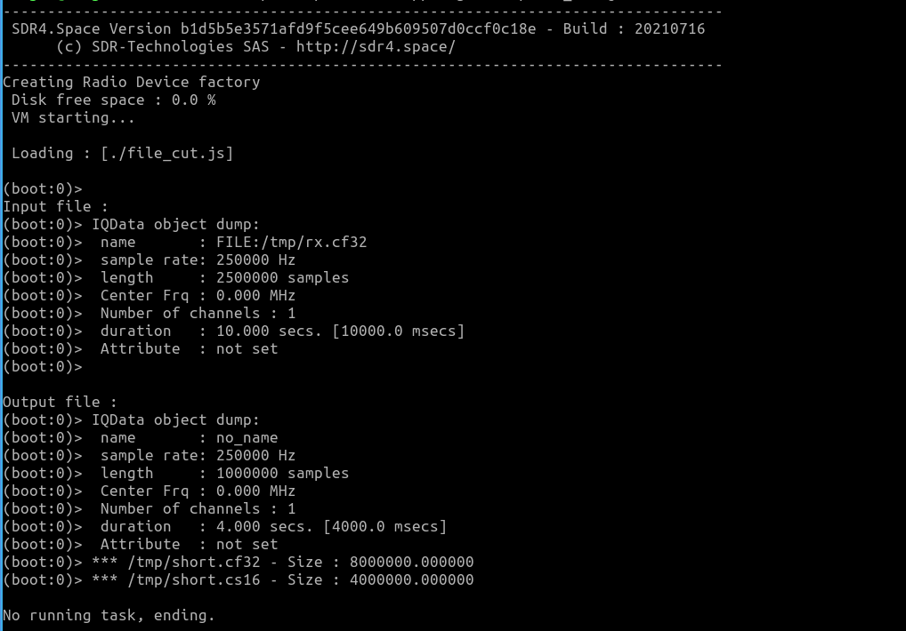
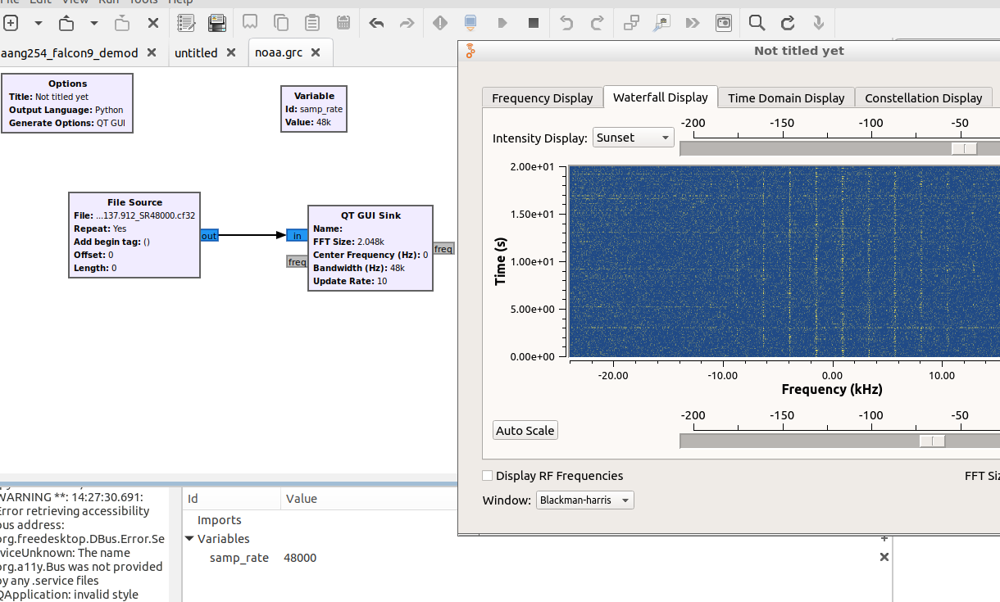
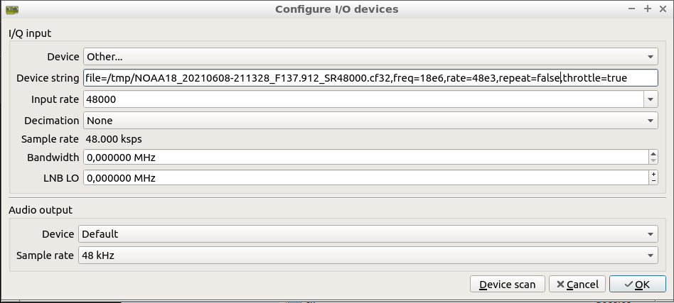
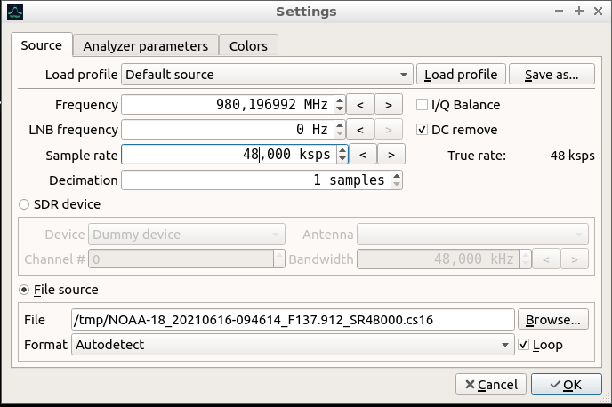

## Files

### IQ file format

By using correct extension for your IQ files, sdr4space.light app is able to handle several IQ formats :  
- .CF32  
- .CS16  
- .WAV (CS16 with WAV header)  
- .CU8  


More on IQ files/objects :  http://sdr4.space/doc/#savetofile

### Cut (shorten) IQ file


* Script `file_cut.js` :

This example loads an existing CF32 file `/tmp/rx.cf32` at 250kS SR and shorten the duration from original file (10 seconds) to 4 seconds, creating a CS16 and CF32 file,  
As result we get two files : `/tmp/short.cf32` and `/tmp/short.cs16`  



- Note: to create the input IQ file '/tmp/rx.cf32' run the following script which records a 250kHz subband, duration 10 seconds on 105.5 MHz from a RTLSDR device @1MSps  

``` javascript
IO.fdelete('/tmp/rx.cf32');
var rx = Soapy.makeDevice({'query' : 'driver=rtlsdr' }) ;
rx.setRxCenterFreq( 105.2 );
rx.setGain( 65 );
rx.setRxSampleRate(1000000);
var freq = rx.getRxCenterFreq();
print("Freq : ",freq.toFixed(3)," MHz");
print("SR : ",rx.getRxSampleRate().toFixed(0));
var IQ = rx.captureSubBand( 2.5e6, 300e3, 250e3 );
IQ.dump();
IQ.saveToFile('/tmp/rx.cf32') ;
```

### Convert IQ file

Convert CS16 to CF32 file using sdr4space.lite is simple as renaming a file (IQ object) from .cs16 to .cf32 !

* Script `cs16_cf32.js` :

``` javascript

// Convert CS16 IQ file to CF32.

var input_file = '/tmp/NOAA-18_20210616-094614_F137.912_SR48000.cs16'
var cf32_file = input_file.slice(0, input_file.length - 5) + '.cf32'  // output name
var input_samplerate=48e3;

// Open CS16 file
var samples = new IQData('');
samples.loadFromFile(input_file);   // load input file

samples.setSampleRate(input_samplerate)
print('CS16 original file:')
print( 'Size : '+ IO.getfsize(input_file) + '\n');  // display input file size
samples.dump();


// Save new CF32 IQ file
samples.saveToFile(cf32_file);  // write new CF32 file to disk
var new_cf32 = new IQData('');

// open and check
new_cf32.loadFromFile(cf32_file);  //  checking : reload new file
new_cf32.setSampleRate(input_samplerate);

print('\n \nCF32 file:');  //display size and infos 
print( 'Size : '+ IO.getfsize(cf32_file) + '\n');
new_cf32.dump(); 

```

* From console we get following log :  

``` text
 Loading : [././cs16_cf32.js]

(boot:0)> CS16 original file:
(boot:0)> Size : 117448704

(boot:0)> IQData object dump:
(boot:0)>  name       : FILE:/tmp/NOAA-18_20210616-094614_F137.912_SR48000.cs16
(boot:0)>  sample rate: 48000 Hz
(boot:0)>  length     : 29362176 samples
(boot:0)>  Center Frq : 0.000 MHz
(boot:0)>  Number of channels : 1
(boot:0)>  duration   : 611.712 secs. [74841.1 msecs]
(boot:0)>  Attribute  : not set
(boot:0)> 
 
CF32 file:
(boot:0)> Size : 234897408

(boot:0)> IQData object dump:
(boot:0)>  name       : FILE:/tmp/NOAA-18_20210616-094614_F137.912_SR48000.cf32
(boot:0)>  sample rate: 48000 Hz
(boot:0)>  length     : 29362176 samples
(boot:0)>  Center Frq : 0.000 MHz
(boot:0)>  Number of channels : 1
(boot:0)>  duration   : 611.712 secs. [74841.1 msecs]
(boot:0)>  Attribute  : not set

No running task, ending.
```

### Inspect IQ file

#### Inspectrum


https://github.com/miek/inspectrum  
Inspectrum is also available as debian package from most of repositories.

All IQ formats supported. Very good tool to inspect IQ stream.  

#### GNUradio

Basic IQ viewer :




### Replay IQ file

Note : we don't care about displayed frequency.  

#### GQRX  

CF32 files only.  

Settings :



#### SigDigger

All formats supported.  
Sigdigger website :  [link](https://github.com/BatchDrake/SigDigger)


Open settings panel :




## Demodulation

### NBFM

#### csdr

CSDR website :  [link](https://github.com/ha7ilm/csdr)

* Demodulate NOAA to WAV file :

```
cat /tmp/NOAA-15_20210617-073957_F137.620_SR48000.cs16 | csdr convert_s16_f |   \
csdr fmdemod_quadri_cf | csdr limit_ff | csdr deemphasis_nfm_ff 48000 | csdr fastagc_ff |  \
csdr convert_f_s16 | sox -q -t raw -b 16 -e signed -c 1 -r 48000 - -t wav test.wav
```
One line : 

```
cat /tmp/NOAA-15_20210617-073957_F137.620_SR48000.cs16 | csdr convert_s16_f |  csdr fmdemod_quadri_cf | csdr limit_ff | csdr deemphasis_nfm_ff 48000 | csdr fastagc_ff | csdr convert_f_s16 | sox -q -t raw -b 16 -e signed -c 1 -r 48000 - -t wav test.wav

```

#### luaradio

LUAradio website :  [link](https://luaradio.io)

  
-- Example : `luaradio noaa_apt.lua /tmp/DELFI-N3XT_20210609-140326_F145.840_SR48000.cs16`  
-- Input file : CS16 format - Output file : audio WAV


```

local radio = require('radio')
--  outputfile
if #arg < 1 then
    io.stderr:write("Usage: " .. arg[0] .. " <Input filename> \n")
    os.exit(1)
end
 
local input_file = tostring(arg[1])
local if_bandwidth = 48e3
local af_bandwidth = 5e3
local deviation = 20e3

--- io.stderr:write("Frequency " .. frequency  ..  "\n")
 
-- Blocks

-- .CS16 source file
local source = radio.IQFileSource(input_file, 's16le', 48e3)
-- .CF32 source file replace by :
-- local source = radio.IQFileSource(input_file, 'f32le', 48e3)
local fm_demod = radio.FrequencyDiscriminatorBlock(deviation/af_bandwidth)
local af_filter = radio.LowpassFilterBlock(128, 15000)
local af_downsampler = radio.DownsamplerBlock(2) 
local wav_sink = radio.WAVFileSink(input_file .. ".wav",1,16)  -- Single channel, 16 bit samples
 
-- Connections
local top = radio.CompositeBlock()
top:connect(source, fm_demod, af_filter, af_downsampler, wav_sink)
 
-- Let's go
top:run()

```

### GNUradio

