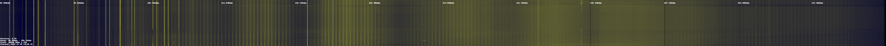

Performs a long-term (several hours/days) and wideband scan at regular intervals.   
The produced CSV file then used by a python script, generating a waterfall image.  

  

- Create rtl_power CSV format files.  
- Based on the famous heatmap.py and rtl_power from [kmkeen](http://kmkeen.com/rtl-power/)  
- Some spectrum analyzers applications are also using this file format.  

By using the script we can adjust the FFT size and frequency span to rounded values (not possible using original rtl_power).  
We can also perform heatmap on several bands (writing on different files), keeping the SDR capture devices free for other tasks when not scanning.  

- This script as been proved to works well using the web display [d3-waterfall](https://github.com/ddcc/d3-waterfall) by one of our customer.  

### Basic use

- Edit config.js file to setup frequency ranges, and define the destination CSV filename(s) for each frequency range.

- Use multi-heatmap.js to start scan.

- Use heatmap_rtl-power.py script to generate PNG heatmap

#### Transfer CSV files to remote server (optional)

- Use boot.js instead to perform scan and upload CSV files using FTP at regular intervals
- Use boot-slownet.js script to transfer files using FTP or PHP to the remote server for low rate connection.
