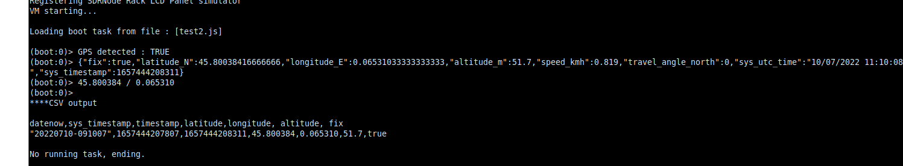

### Spectrum and GPS

#### Requirements

##### GPS
- NMEA GPS connected to serial port or USB GPS emulating serial port. You have to find on your system the right /dev/tty port used by the GPS, and maybe run SDR4space using sudo.  
- `gpsd` daemon needs to be stopped (not disabled, stopped is enough) --> `sudo systemctl stop gpsd`
- with *gpsd* service stopped test connectivity to GPS : `gpsmon /dev/ttyXXX`
- Launch SDR4space application using `-g` switch :  
  `-g, --gps arg       set GPS NMEA source port input (ex: /dev/ttyACM0)`
- For some cases, forcing speedrate might help :
  `-b, --baudrate arg  GPS Baudrate (default: 9600)`
  
##### WebServer

- optional, requires license to enable module

- use `-w` parameter at launch  
  To customize webserver add a *conf* directory at the same level of your SDR4space application. Create a `./conf/sdrvm.conf` file :

````
[http_server]
port=8080
home=/tmp
````

  Example :
   `/usr/src/SDR4space/SDR4space -w -g /dev/ttyACM0 -f /home/user/gps.js`

### Basic GPS logger

#### Example 


Create CSV file to log actual location.

``` javascript
// System time
var timestamp = new Date().toISOString().replace(/[^\w]/g, "");
var date = timestamp.slice(0, -4);
var datenow =  date.replace("T", "-") ;
var sys_timestamp = Math.round((new Date()).getTime());

var mypos='NO_FIX';
var gps= System.GPSAvail() ;

print('GPS detected : ',gps);

if (gps) {
	sleep(500);
	var mypos = System.GPSInfos();
	print(JSON.stringify(mypos));
	var latitude = JSON.parse(mypos.latitude_N).toFixed(6);
	var longitude = JSON.parse(mypos.longitude_E).toFixed(6);
	var altitude = JSON.parse(mypos.altitude_m).toFixed(1);
	var fix = mypos.fix;
//	var now = JSON.stringify(mypos.sys_utc_time);
	var timestamp = JSON.stringify(mypos.sys_timestamp);

mypos= latitude + ' / ' + longitude;
print(mypos);

} else {
var latitude=0;
var longitude=0;
var altitude=0;
var timestamp = 0;
}

var csv_header = 'datenow,sys_timestamp,timestamp,latitude,longitude, altitude, fix\n';
csv_header += '\"' + datenow + '\",' + sys_timestamp + ',' + timestamp + ',' + latitude + ',' + longitude + ',' + altitude  + ',' + fix;
print('\n****CSV output\n\n',csv_header);
```


### Basic GPS test: display location on web page.

- requires a full license to enable the webserver module  
- go to `test_gps-web` folder
- run main.js script 
- GPS location will be displayed with auto-refresh every 5 seconds on http://<host_ip:8080/gps .
- Run :  
`/opt/vmbase/sdrvm -w   -g /dev/ttyACM0  -f main.js`


### Example: wide_spectrum folder

#### Script boot.js
*boot.js* is the main script to start (calling *gps_wide.js*): a permanent loop on which we define one or more frequency ranges to monitor:  

```
for (;;) {
var d= createTask('gps_wide.js.js','921','925','gsmr.csv');
waitTask(d);
var e= createTask('gps_wide.js','88','108','wbfm.csv');
waitTask(e);
sleep(2000);
}
```
The above example  produces a 921 to 925MHz montoring to *gsmr.csv* file, and another one from 88 to 108 MHz to *wbfm.csv* file  

#### script gps_wide.js  
We will generate a CSV file containing on each row timestamps, observer location (if GPS fix), and signal levels for frequencies defined in range.   
The script will check if GPS is present or not on the system, then run a permanent loop to scan spectrum on a predefined frequency.  
- To get a rounded number for frequencies, adjust samplerate and FFT size :  
    - Samplerate 2560 kS/s with FFT=256 will produce 10 kHz steps for the frequencies    
    - Samplerate 5120 kS/s with FFT=256 will produce 20 kHz steps for the frequencies  
- We will also generate spectrum plots on the destination directory.

You can notice the powerSpectrum() command will retrieve the position directly from the GPS if possible :

````
(boot:0)> {"data_type":"power_spectrum","fft_size":256,"sample_rate":2560000,"channel":0,"timestamp":1656696082778,"position":{"gps_fix":true,"latitude_N":45.79993816666667,"longitude_E":0.06495116666666666,"altitude":58.3},"spectrum":[-79.436,-79.366,-79.518,-79.503,-79.196,-79.049,-79.218,-79.203,-79.123,-78.958,-78.652,-78.359,-77.995,-77.58,-77.045,-76.742,-76.432,-75.936,-75.842,-75.813,-74.59,-70.81,-67.561,-64.003,-61.304,-58.713,-56.496,-53.737,-51.657,-50.042,-46.404,-46.024,-43.838,-44.159,-43.104,-42.648,-42.857,-41.73,-40.484,-41.309,-41.096,-40.29,-40.929,-42.261,-44.73,-48.796,-46.81,-47.301,-48.026,-49.538,-53.434,-55.907,-58.267,-62.273,-66.985,-69.77,-65.841,-50.659,-46.625,-51.994,-68.747,-73.909,-74.111,-74.328,-74.712,-74.938,-75.294,-75.394,-75.292,-75.37,-75.259,-75.13,-75.102,-75.16,-75.299,-75.203,-74.927,-74.958,-75.023,-74.878,-74.929,.....]
````

##### Check settings
- gps_wide.js file :
  - SDR device
	````  
	var sdr_device='driver=plutosdr';
	````
  - Spectrum resolution :
	````
	var samp_rate=5000e3;
	var FFT = 250;
	````
  - Destination directory for plots and CSV
  	````
  	var dest_dir='/tmp/';
  	````
##### resulting CSV file
````
datenow,sys_timestamp,timestamp,latitude,longitude, altitude, fix,921,921.02,921.04,921.06,921.08,921.1,921.12,921.14,921.16,921.18,921.2,921.22,921.24....
"20220710-084344",1657442624270,1657442624744,45.800358,0.065314,51.2,true,-46.35,-46.255,-46.297,-46.164,-45.794,-45.102,-44.655,-43.365,-41.833,-41.278,-41.3,......
"20220710-084357",1657442637783,1657442638191,45.800325,0.065257,39.7,true,-47.107,-46.949,-46.805,-46.619,-46.496,-46.066,-45.556,-44.524,-43.406,-42.934,-42.872,-42.261,-38.058,-33.002,-29.199,-26.086,-21.921,........
````

### Example:  wide_spectrum_web folder

Will work exactly the same way, but we added a webserver.  
This allow to monitor both GPS and capture at the same time by opening :  
- http://<host_ip:8080/gps to display the last plot  
- http://<host_ip:8080 to display the directory contents (defined by `conf/sdrvm.conf` file)  
- Web page auto-reloads every 5 seconds.  
- Comment/Uncomment following line in gps_web.js to use big font size adapted to portable devices :  
   `sendResponse('<font size="10">');`


### Kepler.gl

Links :  
- https://www.analyticsvidhya.com/blog/2020/06/learn-visualize-geospatial-data-jupyter-kepler/  
- https://medium.com/vis-gl/introducing-kepler-gl-for-jupyter-f72d41659fbf

#### Web 
- Inject the CSV file to [kepler demo page](kepler.gl/demo), select correct frequecy on the label colors tool.  
- Customize, add layers, apply filters.  
- From this point we can export/share from Kepler, getting a unique HTML file ready to use.


#### keplergl-cli

Link: https://github.com/kylebarron/keplergl_cli  

- Create a kepler HTML page from basic python script.
````
from keplergl_cli import Visualize
import pandas as pd
df2 = pd.read_csv('/home/eric/SDRT/kangoo/logs/charente.csv', usecols=['datenow',  'latitude', 'longitude', 'altitude', 'timestamp','921.2','921.4','921.6','921.8','922','922.2','922.4','922.6','922.8','923','923.2','923.4','921.6','923.8','923.4','923.8','924','924.2','924.4','924.6','924.8','924.4','924.8'])
Visualize(df2,style='mapbox://styles/lamableu/cl5kw9f7r003b14s0rbj4mtgu')

````

