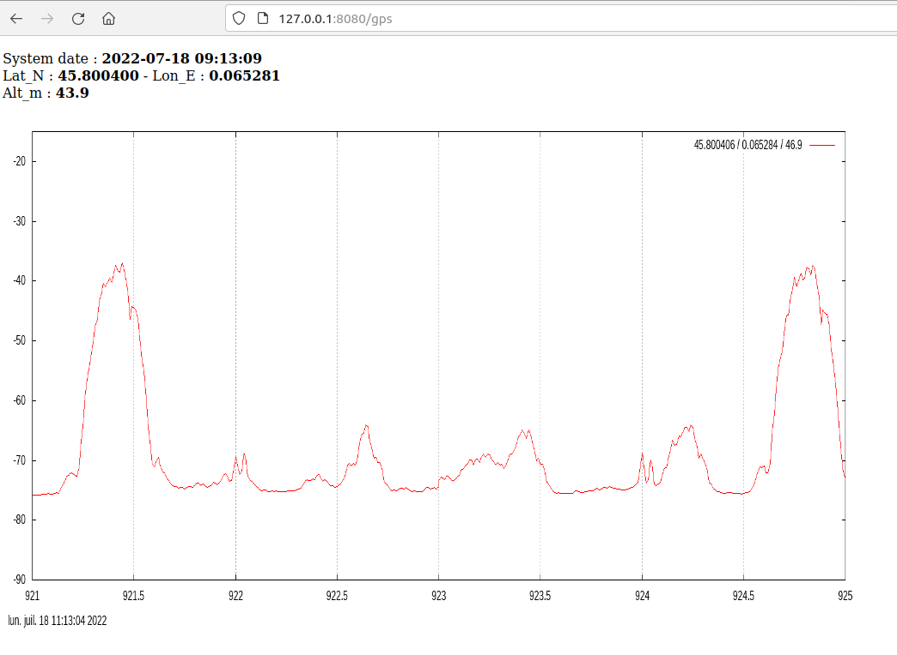

## Requirements  
##### GPS
- NMEA GPS connected to serial port or USB GPS emulating serial port. You have to find on your system the right /dev/tty port used by the GPS, and maybe run SDR4space using sudo.  
- `gpsd` daemon needs to be stopped (not disabled, stopped is enough) --> `sudo systemctl stop gpsd`
- with *gpsd* service stopped test connectivity to GPS : `gpsmon /dev/ttyXXX`
- Launch SDR4space application using `-g` switch :  
  `-g, --gps arg       set GPS NMEA source port input (ex: /dev/ttyACM0)`
- For some cases, forcing speedrate might help :
  `-b, --baudrate arg  GPS Baudrate (default: 9600)`
  
##### WebServer

- active license to enable the WebServer module
- use `-w` parameter at launch  
  To customize webserver add a *conf* directory at the same level of your SDR4space application. Create a `./conf/sdrvm.conf` file :

````
[http_server]
port=8080
home=/tmp
````


## Check settings
- gps_wide.js file :
  - SDR device
	````  
	// SoapySDR name
	var sdr_device='driver=plutosdr';
	````
  - Spectrum resolution :
	````
	var samp_rate=5000e3;
	var FFT = 250;
	````
  - Destination directory for plots and CSV
  	````
  	var dest_dir='/tmp/';
  	````

## Run script

We will call `boot.js` with GPS and webserver enabld, take inspiration from this example :

`./SDR4space -w   -g /dev/ttyACM0  -f boot.js`


## More informations

#### The web part

We will monitor both GPS and spectrum capture at the same time by opening :  
- http://<host_ip:8080/gps to display the last plot  
- http://<host_ip:8080 to display the directory contents (defined by `conf/sdrvm.conf` file)  
- Web page auto-reloads every 5 seconds.  
- Comment/Uncomment following line in gps_web.js to use big font size adapted to portable devices :  
   `sendResponse('<font size="10">');`

#### Script boot.js
*boot.js* is the main script to start (calling *gps_wide.js*): a permanent loop on which we define one or more frequency ranges to monitor:  

```
for (;;) {
var d= createTask('gps_wide.js.js','921','925','gsmr.csv');
waitTask(d);
var e= createTask('gps_wide.js','88','108','wbfm.csv');
waitTask(e);
sleep(2000);
}
```
The above example  produces a 921 to 925MHz monitoring to *gsmr.csv* file, and another one from 88 to 108 MHz to *wbfm.csv* file  

#### script gps_wide.js  
We will generate a CSV file containing on each row timestamps, observer location (if GPS fix), and signal levels for frequencies defined in range.   
The script will check if GPS is present or not on the system, then run a permanent loop to scan spectrum on a predefined frequency.  
- To get a rounded number for frequencies, adjust samplerate and FFT size :  
    - Samplerate 2560 kS/s with FFT=256 will produce 10 kHz steps for the frequencies    
    - Samplerate 5120 kS/s with FFT=256 will produce 20 kHz steps for the frequencies  
- We will also generate spectrum plots on the destination directory.

You can notice the powerSpectrum() command will retrieve the position directly from the GPS if possible :

````
(boot:0)> {"data_type":"power_spectrum","fft_size":256,"sample_rate":2560000,"channel":0,"timestamp":1656696082778,"position":{"gps_fix":true,"latitude_N":45.79993816666667,"longitude_E":0.06495116666666666,"altitude":58.3},"spectrum":[-79.436,-79.366,-79.518,-79.503,-79.196,-79.049,-79.218,-79.203,-79.123,-78.958,-78.652,-78.359,-77.995,-77.58,-77.045,-76.742,-76.432,-75.936,-75.842,-75.813,-74.59,-70.81,-67.561,-64.003,-61.304,-58.713,-56.496,-53.737,-51.657,-50.042,-46.404,-46.024,-43.838,-44.159,-43.104,-42.648,-42.857,-41.73,-40.484,-41.309,-41.096,-40.29,-40.929,-42.261,-44.73,-48.796,-46.81,-47.301,-48.026,-49.538,-53.434,-55.907,-58.267,-62.273,-66.985,-69.77,-65.841,-50.659,-46.625,-51.994,-68.747,-73.909,-74.111,-74.328,-74.712,-74.938,-75.294,-75.394,-75.292,-75.37,-75.259,-75.13,-75.102,-75.16,-75.299,-75.203,-74.927,-74.958,-75.023,-74.878,-74.929,.....]
````


#### resulting CSV file
````
datenow,sys_timestamp,timestamp,latitude,longitude, altitude, fix,921,921.02,921.04,921.06,921.08,921.1,921.12,921.14,921.16,921.18,921.2,921.22,921.24....
"20220710-084344",1657442624270,1657442624744,45.800358,0.065314,51.2,true,-46.35,-46.255,-46.297,-46.164,-45.794,-45.102,-44.655,-43.365,-41.833,-41.278,-41.3,......
"20220710-084357",1657442637783,1657442638191,45.800325,0.065257,39.7,true,-47.107,-46.949,-46.805,-46.619,-46.496,-46.066,-45.556,-44.524,-43.406,-42.934,-42.872,-42.261,-38.058,-33.002,-29.199,-26.086,-21.921,........
````

 

