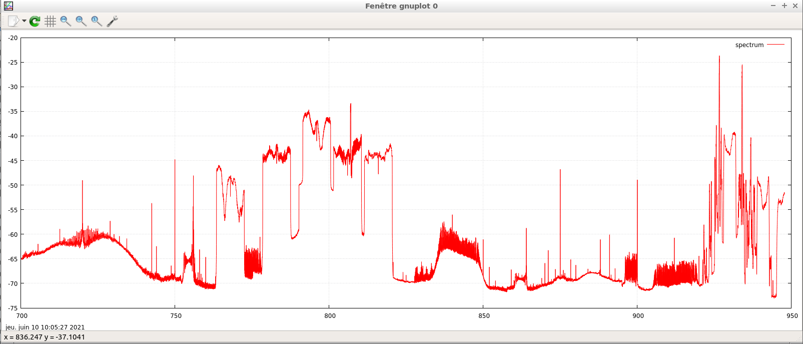

## Spectrum

We are using a simple command [*.getPowerSpectrum()*](http://sdr4.space/doc/#getpowerspectrum) to get FFT, and [*rx.Capture()*](http://sdr4.space/doc/#capture_1) command to get our samples.  
The [*.getPowerSpectrum()*](http://sdr4.space/doc/#getpowerspectrum) command will create a FFT and return datas as a JSON object.  
Script will perform a quick conversion from JSON to CSV before sending data to GNUplot ( external GNUplot script is called by [*System.exec()*](http://sdr4.space/doc/#systemexec) command)

### Requirements

Depending of your distribution install one of these packages : *gnuplot*, *gnuplot-x11*, *gnuplot*, *gnuplot-nox*, *gnuplot-qt*.  
*gnuplot-qt* is not working with our AppImage version (use gnuplot-x11 instead) !

### Basic spectrum

#### Folder : [0a_simple_spectrum](0_simple_spectrum)

The script will perform a quick capture of the whole spectrum for the device, in one pass, bandwidth  depending on the sample rate of your SDR device.  
We are creating a CSV file `/tmp/spectrum.csv`  
Resulting plot is stored in `/tmp/plot.png` directory  
Once done, use [IO.FTPSend()](http://sdr4.space/doc/#ioftpsend) or [IO.SFTPsend()](http://sdr4.space/doc/#iosftpsend) commands to upload plot or spectrum datas to a remote server.  
  

#### Folder :  [0a_simple_spectrum](0a_simple_spectrum)  

The next evolution for the spectrum.  
Very easy to understand, no need to edit the file anymore.  
Invoking the app/script, use argument to define center frequency.  
GNUplot is not used anymore, we are calling our internal GIFimage library.  

### Wide spectrum

This example will run successive captures in a frequency range (and perform some basic cropping), then launch gnuplot-x11 GUI to display resulting plot.  

