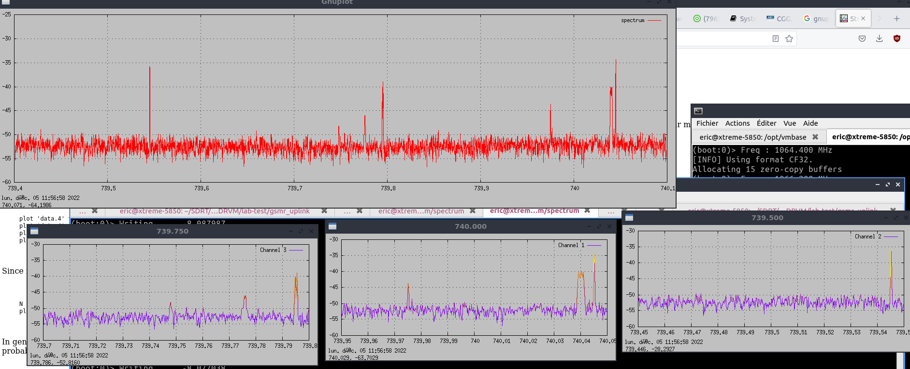

#### Animated spectrum with channels

Display a main live spectrum using DDC feature.  
Display in separate windows sub_channels coming from inside the spectrum.  


#### Example 1 :  QO100 hamradio (narrow band transponder)
 
##### Usage

`/opt/vmbase/sdrvm -f boot.js`
 

This is an example for QO 100 narrow-band transponder centered on 739.750MHz.  
Child windows are channels displaying left, center, and right beacons from the tranponder.  

* Declare subchannels :  
For subchannels: define fmin, fmax and channel number.  
```
// Subchannels
// args : fmin, fmax, channel number
createTask('start_gnuplot_spectrum_sub.js',739.95,740.05,1);
createTask('start_gnuplot_spectrum_sub.js',739.45,739.55,2);
createTask('start_gnuplot_spectrum_sub.js',739.70,739.8,3);

```

* Change SDR device:  
var rx = Soapy.makeDevice({'query' : 'driver=rtlsdr' }) ;

* Plot scale level :  
Adapt `set yrange [-90:-30]` in .gnu files.


* Change main center frequency :  
`rx.setRxCenterFreq( 739.4 );`  

* Main spectrum bandwidth (should fit on device samplerate):  

`slice.setOutBandwidth(700e3);`

* optional:  
Apply a shift from central frequency  
`slice.setCenter( 350e3 );`




#### Example 2 : WBFM.js 
  
##### Usage  
  
`/opt/vmbase/sdrvm -f WBFM.js`  

* Inspecting 2 channels on WBFM broadcast band with different bandwidth for subchannels.  


Video : 


