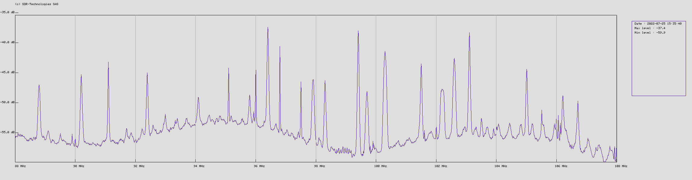
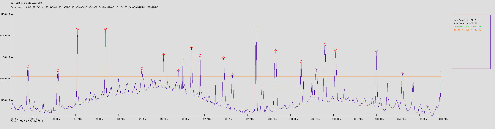

### spectrumplot.js

Introducing plot as function :  
```` javascript
function plotSpectrum(spectrum_array, output_file)  
 ````  
  
 
- As input send array with following keys : `frequencies`, `spectrum`  
```` json
{"frequencies":[88,88.1,90 ], "spectrum":[-53.2, -53.0, -54]}
````  
Compatible with .getPowerSpectrum() command.  

- Output file is optional, set by default to '/tmp/myspectrum.gif'  

- For X-axis the number of xtics has to be set (default 10).  
```` javascript
var xtics=10;
````
means we will have one 'tic' on the X-axis every 2MHz for a 20MHz BW spectrum


### spectrumgif.js :

- Performs a wide spectrum scan and detects signals above the 'trigger level'  




- Note: for the above example, `xtics` is set to 20.
